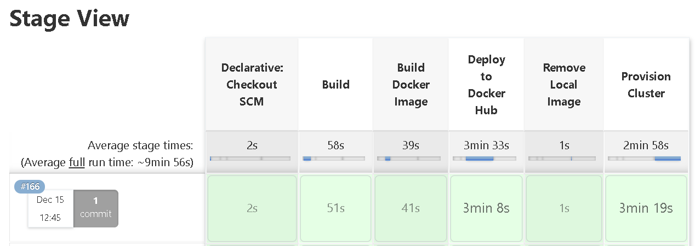
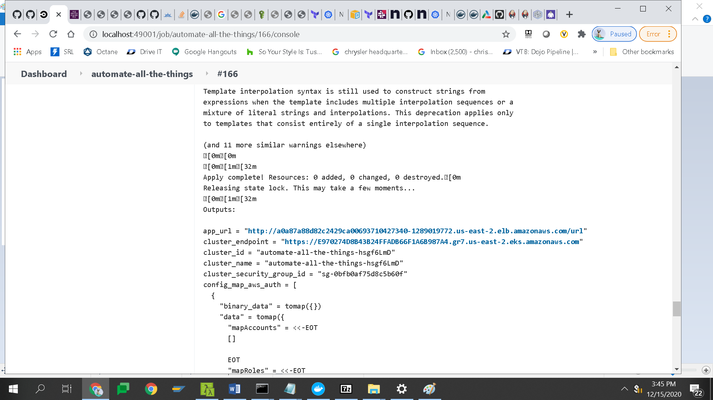

# automate-all-the-things

> We're all using it - the continuous integration and continuous delivery pipeline. 

## Purpose of this repo

> An example repo for deploying a node app (REST API) hosted inside a docker container to an EKS cluster in AWS. The application is built and deployed using a Jenkins CI/CD pipeline.

## How it works

> This is a description of how this app and deployment works.

## Prerequisites for AWS Access

- You must have a valid IAM user access id and secret key from AWS with the AdministratorAccess policy.
- You must create a jenkins user password credential named 'AWS_ACCESS_KEY' for this IAM user. Information on how to create credentials in Jenkins is referenced [here](https://www.jenkins.io/doc/book/using/using-credentials/). 

## Prerequisites for Jenkins server

- The server must be exposed to the internet to receive github commit/pull requests. For more information on how to expose a local port securely visit the ngrok site (https://ngrok.com/).

- install: Install node & npm on your jenkins server (https://nodejs.org/en/).
- install: Install docker on your jenkins server (https://www.docker.com/).
- install: Install terraform  on your jenkins server (https://www.terraform.io/).
- install: Install aws iam authenticator on your jenkins server (https://docs.aws.amazon.com/eks/latest/userguide/install-aws-iam-authenticator.html).
- install: For convenience, install kubectl on the server (https://kubernetes.io/docs/tasks/tools/install-kubectl/)

## Pre-built Jenkins server docker image

If you wish to run a pre-built docker image for jenkins for this example, one is available here:

- https://hub.docker.com/repository/docker/chrisgallivan/jenkinsnpm

If you have docker installed and wish to run this container on your machine:

- run from a command prompt: `docker run -d -p 49001:8080 -v $PWD/jenkins:/var/lib/jenkins -t chrisgallivan/jenkinsnpm:latest`
- drink: a small coffee or espresso
- The first time you run jenkins you will need to login with the admin user password following the instructions [here](https://www.jenkins.io/doc/book/installing/linux/#setup)

NOTE - In this example, the server will be available on port 49001 on your local machine (http://localhost:49001/).
The first time you run jenkins you will need to login with the admin user password following the instructions [here](https://www.jenkins.io/doc/book/installing/linux/#setup-wizard).

## Getting started

- fork a copy of this [repo](https://github.com/chrisgallivan/automate-all-the-things) following instructions [here](https://docs.github.com/en/free-pro-team@latest/github/getting-started-with-github/fork-a-repo)
- create a Jenkins pipeline job following the instructions [here](https://www.jenkins.io/doc/book/pipeline/getting-started/#defining-a-pipeline-in-scm).
- make sure to use your forked repo in the setup of the pipeline job and make sure it is pointing to the proper branch:)

## Terraform state setup

This project uses Terraform for provisioning the cloud infrastructure and container. Prior to using terraform, you need to setup a way to handle state. 
- log into your jenkins server and navigate to the working directory of your jenkins job
- cp the main.tf file from the repo into a location that has terraform installed (perhaps on the jenkins server). 
- Using your IAM credentials in the pre-requisites, run terraform init and terraform apply as documented in this [example](https://blog.gruntwork.io/how-to-manage-terraform-state-28f5697e68fa) to create your s3 bucket and dynamo db table. 
- Re-run terraform init to upload your terraform.tfstate to the s3 bucket.

## The moment of truth

- create a webhook from your github repo to the jenkins pipeline job following the instructions [here](https://dzone.com/articles/adding-a-github-webhook-in-your-jenkins-pipeline).
- make a change to the README.md file in your repo. You should see your first build trigger on the jenkins pipeline job.
- if everything is properly configured, you should see something similar to this image in your jenkins pipeline job:

- click on the build - Console Output  - and look for the app_url declaration. Click on the hyperlink to view the deployed app on the cluster:

# What I learned

> I learned a ton in taking on this exercise. The following is a top 10 list of learnings (there were many more):

- First time I used supertest to test a node api (using TDD)
- First time I used a local jenkins docker image
- First time I used ngrok :)
- First time I published a docker image to docker hub (we have been using Artifactory)
- First time I used s3 and dynamo for storing and locking terraform state (we have been using Artifactory)
- First time I created an EKS cluster
- First time I deployed a container to a cluster from Terraform
- I learned why so many people prefer to deploy to containers. It is so easy!
- I learned more about the grimble of Terraform, in painstaking fashion with backend auth and mutiple defns of the same provider
- First time I used the kubernetes provider to deploy to an EKS cluster

## Improvement ideas

- Make the jenkins container into a dockerfile for added flexibility
- Introduce concept of environments in the pipeline and code to enable switching of environments via branching
- Setup webhooks at the organizational level so there is no need to configure a jenkins job
- Find a way to suppress the dockerhub publish until the stage/prod deploy to speed up the pipeline
- Create a generator for scaffolding the repo based on user input. Could use backstage for this.

## Contributions
Help me make this better by making a pull request.
